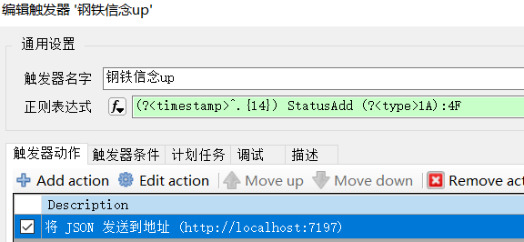
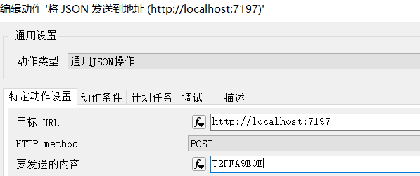
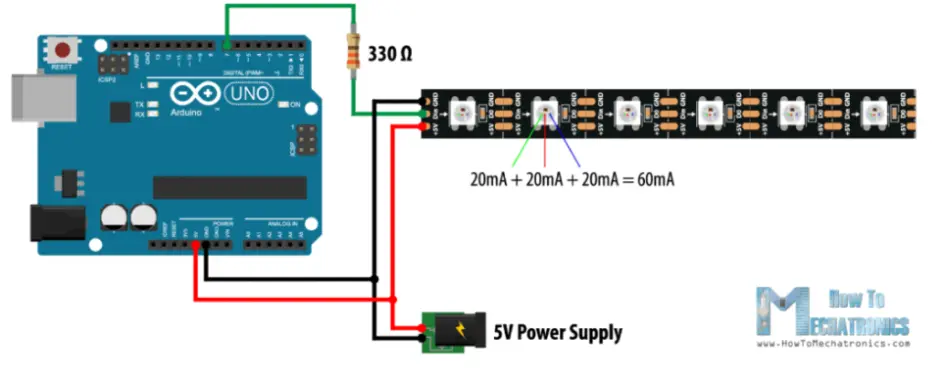
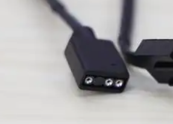

# xiv-argb-fans
Using arduino to link argb LED device and PC games together
Now developing : synchronization between FFXIV character buff and argb Fans
An usage case: https://www.bilibili.com/video/BV1dT411T7y8

## FF14 角色buff联动风扇颜色
使用例见上文链接

使用方法：

1.将Arduino开发板连接到电脑的USB2.0端口上（听说USB3.0最大电流太大了不好使）

2.开启控制程序，以python版本为例：
- 运行`python hud_python/checkserial.py`，从输出信息中找到arduino对应的串口号(例如`"COM27"`)
- 修改`getmessage.py`中的`serial_port`变量为前面找到的串口号
- 运行`python hud_python/getmessage.py`，开始监听端口

3.设置ACT Triggernometry插件，在匹配到指定行为时发送灯光控制指令（详见`protocol.md`)

4.在ACT中执行触发器，若测试效果无误即可正常使用

### 游戏状态获取
通过ACT读取战斗日志，用触发器向控制程序发送包含灯光控制指令的http请求

### 控制程序
用中间程序监听指定端口的http请求，接收ACT的指令，处理并通过USB串口发送给arduino开发板

**C#版本**
代码见hud/light_ctl文件夹 (施工中)

**python版本**
代码见hud_python文件夹

### arduino
代码见light_control文件夹
需要FastLED库

接线示意图（图片来源于网络）

接LED是这么接↑
接argb风扇5V3pin接口的话，如下图，最左边是接地（黑线），中间接控制端口（绿线），右边接5V供电（红线）

控制端口的端口号应和`light_control.ino`中的`LED_PIN1`对应
（可以接多个端口控制不同组风扇）

### LED风扇
使用5v3pin接口的argb风扇，WS2812B协议
也可以接LED灯条